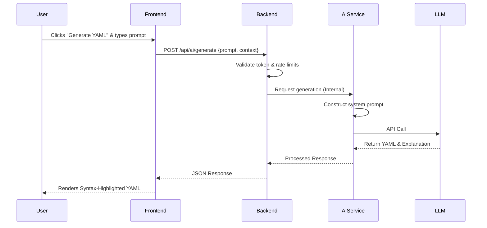
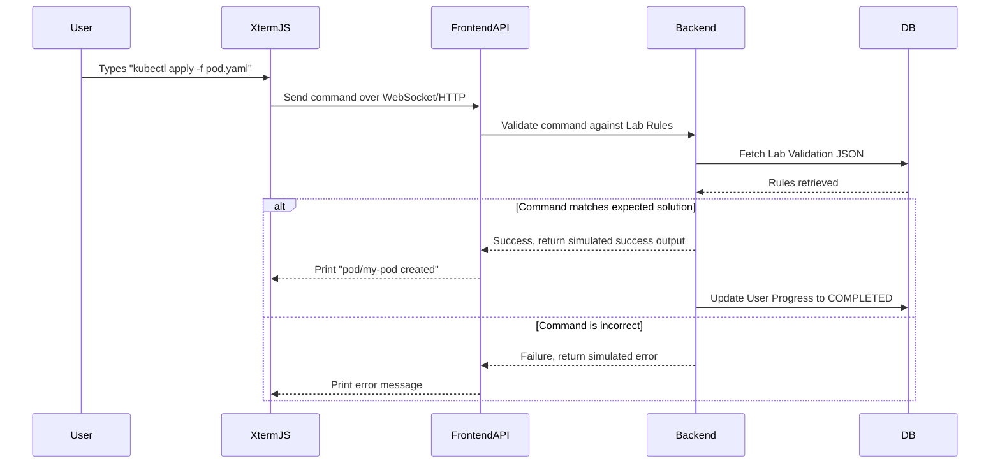

# System Architecture & API Flow

This document outlines the high-level system architecture and data flows for the Docker & Kubernetes Learning Platform.

---

## 🏗️ High-Level Architecture

The platform follows a microservices-inspired monorepo architecture, separating the client application, the core business logic, and the specialized AI processing into distinct services.

```mermaid
graph TD
    Client[Web Browser / Client]
    
    subgraph "Frontend Layer"
        NextJS[Next.js App\n(UI, React, Tailwind)]
    end
    
    subgraph "Backend Layer"
        NestJS[NestJS API Gateway\n(Auth, Progress, Courses)]
        DB[(PostgreSQL)]
        Redis[(Redis Cache)]
    end
    
    subgraph "AI & Execution Layer"
        AIService[AI Microservice\n(Python/Node)]
        OpenAI[OpenAI / Gemini API]
        LabRunner[Lab Execution Engine\n(Simulator / Sandbox)]
    end

    Client <-->|HTTPS / WebSockets| NextJS
    NextJS <-->|REST / GraphQL| NestJS
    NestJS <--> DB
    NestJS <--> Redis
    NestJS <-->|Internal gRPC/HTTP| AIService
    NextJS <-->|Direct WS for Terminal| LabRunner
    AIService <--> OpenAI
```

### Component Details
1. **Next.js Frontend**: Server-Side Rendered (SSR) application responsible for delivering the UI, Markdown course rendering, and hosting the Xterm.js terminal component for the interactive playground.
2. **NestJS Backend**: The core API handling user authentication (JWT), course progression, database querying via Prisma, and validating quiz results.
3. **AI Microservice**: A dedicated service that wraps LLM APIs. It receives context (e.g., "User is on Lesson 3, asked about Pods") and constructs precise prompts to generate YAML, explain errors, or act as a chatbot.
4. **Lab Execution Engine**: In Phase 1, this is a simulated terminal backend. In Phase 2, it will securely interface with a real Kubernetes cluster via the K8s API to spin up ephemeral namespaces for users.
5. **PostgreSQL**: Primary data store for all persistent data.
6. **Redis**: Used for session caching, rate limiting (crucial for AI API protection), and WebSocket pub/sub if scaling the terminal connections.

---

## 🔄 Core Interaction Flows

### Flow 1: User Requesting AI YAML Generation



### Flow 2: Interactive Terminal Lab Validation (Simulated MVP)



---

## 🛡️ Security Considerations

* **Rate Limiting**: The AI Service endpoints must have strict IP and User-based rate limits via Redis to prevent abuse of expensive LLM API calls.
* **Input Sanitization**: All terminal inputs from the user in the interactive playground must be sanitized. Even in a simulated environment, preventing XSS in the terminal rendering component (Xterm.js) is critical.
* **Authentication**: Use short-lived JWTs and secure, HttpOnly cookies for session management to protect against XSS token theft.
